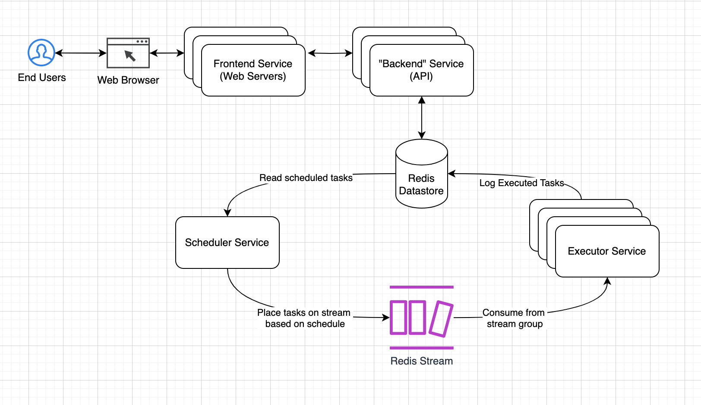

# Design Document: Distributed Task Scheduler

## Overview
This distributed task scheduler allows clients to register one-time and recurring tasks. Tasks are executed within 10 seconds of their scheduled time.

## Core Requirements
- Task Types: One-time and recurring tasks.
- Scheduling: Clients can register tasks to be executed immediately, or via cron syntax.
- Execution Time: Tasks should be executed within 10 seconds of the scheduled time.

## Services
### Frontend Service
- The end-user interface for task registration and management. Interfaces with the backend API via REST endpoints.
### Backend (API) Service
- The REST API serving the frontend service; allows for task registration and management.  Stores scheduled tasks to redis, queries redis for scheduled tasks and executed tasks.
### Scheduler Service
- The actual "clock" or cron service which handles task scheduling, sending tasks to the Executor via Redis Stream when tasks need to be executed.
### Executor Service
- Executes tasks as received.  The "worker nodes" of the system.

## Other Components
### Redis 
- Database: durable storage for task details and schedules.
- Stream: Used to notify Executor services when tasks are due.
- *Each can be scaled horizontally to handle increased load.*

Note: I went with a single DB/stream provider for task simplicity's sake.  Could also use kafka for the task log, postgres for the task schedule storage, etc.

### High-Level Diagram

## High Availability & Durability
### Frontend & Backend Services
- Deploy a minimum of 2 instances each of Frontend web servers & Backend API behind respective kubernetes `service`s (k8s `service`s resolve to load balancers in AWS).  
- Configure k8s HPA to scale based on memory and/or CPU usage.
### Scheduler
- Configure kube deployment to ensure there is always a single instance of the scheduler running.
### Executor
- Deploy a minimum of 2 Executor services. 
- Configure k8s HPA to scale based on memory and/or CPU usage, or even a custom metric like stream message count (such that Executors are added/removed based on the number of tasks to be executed).
### Redis database & stream
  - Both redis data store and redis streams are clusterable and active-active replicable for maximum durability.

## Cost-Effectiveness
### Containerization
- Use Docker to containerize & ship components (& dependencies) for efficient resource utilization.
### Kubernetes resource limits
- Configure resource limits for containers (same as a kube pod in our case) to prevent resource wastage.
### Karpenter
- Use Karpenter (if on AWS) for efficient use of ec2 instances. Karpenter will automatically choose the least expensive instance types that meet the resource requirements of a cluster's pods.  
*(Without Karpenter, AWS limits you to a single instance type per cluster, which can lead to wasted resources.)*
### Auto-scaling
- Implement horizontal pod auto-scaling for Frontend, Backend, and Executor services.
### Cloud Services
- If Karpenter is used, can easily start with free tier ec2 instances and scale up as needed.

## Choke Points & Mitigation
### Executor bottleneck
- I can envision certain tasks being "heavy" and some being "light."  To mitigate this, I might implement **both** custom metric scaling (scale based on stream count stream count) **and** CPU and memory based scaling. This way, if the stream is backed up OR if executors are struggling CPU- or memory- wise to handle tasks, more Executors are added to handle the load.

### Scheduler - a single point of failure
- In this design, there is always exactly one scheduler running.  If millions of tasks are scheduled, this could lead to a high amount of memory usage in this service (as it needs to keep track of all tasks).  To mitigate this, I could implement a **sharding** strategy where tasks are split up among multiple schedulers, possibly by the month or even the day field of the cron syntax. The sharding could be extended to the streams, as well, but then we'd ideally switch to Kafka (or another stream provider that supports sharding natively).
---
For future considerations, see [Future thoughts](future.md).
